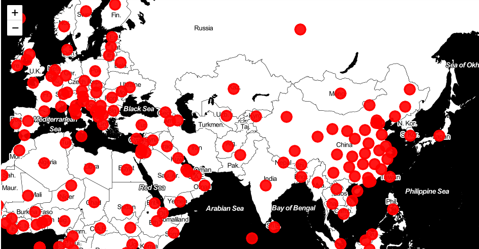

_document

  
  我们是DingSpeak组，组员有：程宏宇、王帆、刘晓菡、孙融雪。在上一个视频中我们描述了新型冠病毒COVID-19在欧洲各国的爆发规模，然后对意大利感染新冠病毒的累计人数进行了预测。
  接下来我们来展示对中国境外输入病例的预测过程。
    
# **数据准备与可视化**

##  数据准备

  我们搜集了2020年3月3日至2020年4月22日的总新增感染人数、国内新增感染人数、境外输入新增病例数以及境外输入累计确诊人数。指标间存在以下关系
                                总新增感染人数=国内新增+境外输入新增数
        
##  柱状图对比
  
  为了直观地比较近两月国内新增确诊人数与境外输入确诊人数，我们分别截取了2020年3月14日至3月23日和2020年4月10日至4月19日的数据，绘制并列柱状图描述二者的差别。
  
<div align=center>


从图中可以清晰地看到，在这一时期内，我国国内确诊病例基本为零，但是境外输入病例呈现一个持续上升的趋势，并在3月23日跳到了74最大值。


从这幅图中可以看到，相比3月国内确诊人数有所增长，但是增幅不超过15人，呈波动趋势；境外输入新增病例在4月12日达到顶峰，随后人数逐渐减少，此前在3月28日，我国出台了暂停外籍人士入境的措施，境外输入确诊病例锐减或和此措施的出台相关。
    从两幅图中都可以观察到的是，境外输入病例比国内新增病例数要高，同期最高相差95例。事实上，由于我国在抗击疫情方面采取了及时迅速的措施，例如封闭疫区，研究治疗药物等，2月13日后新冠肺炎的传播趋势已经开始下降，表现为国内新增病例一直呈现下降趋势，但是在3月13日前国内新增确诊人数还高于境外输入，3月13日后，境外输入病例实现了反超。为了判断中国境外输入病例是否会对国内疫情二次爆发造成影响，我们对境外累计输入病例进行了预测。
   
# ** Logistic模型预测境外输入累计病例 **

  我们采用Logistic模型对境外输入累计病例进行了预测，模型如下

$$N_{t}=\frac{K*N_{0}*e^{Rt}}{K+N_{0}*(e^{Rt}-1)}$$
其中$K$为最终规模，$N_{t}$代表时间$t$时的累计确诊人数,$R$为感染率。估计参数$K,R,N_{0}$时,我们采用了R语言中估计逻辑斯蒂方程的一个内建函数SSlogis，它使用的是如下方程
$$N_{t}=\frac{alpha}{1+e^{\frac{xmid-t}{scale}}}$$
```{r,eval=FALSE}
##寻找方程的参数
SS <- getInitial(n ~ SSlogis(m, alpha, xmid, scale), data = df)
```

  我们使用getInitial函数来对模型参数做一个基于数据的初步估计，然后把该函数的输出作为一个向量化参数传递给自启动函数SSlogis，同时也将alpha、xmid、scale三个参数名赋值给逻辑斯蒂方程。然而，由于SSlogis的参数设定有些不同，我们对其输出值做了处理使得其与逻辑斯蒂方程中的形式一致。

```{r,eval=FALSE}
##改变参数形式
K_start <- SS["alpha"]
R_start <- 1/SS["scale"]
N0_start <- SS["alpha"]/(exp(SS["xmid"]/SS["scale"])+1)
```

其中K_start、R_start、N0_start为参数$K,R,N_{0}$的初始值，接下来是拟合模型估计参数的部分

```{r,eval=FALSE}
##拟合模型估计参数
log_formula <- formula(n ~ K*N0*exp(R*m)/(K + N0*(exp(R*m) - 1)))
formu<-nls(log_formula, start = list(K = K_start, R = R_start, N0 = N0_start))
summary(formu)
##计算拟合优度
cor(n,predict(formu))
```

## 结果分析与可视化

代码运行结果如下


结果给出了参数的取值，分别为$K=1798，R=0.1185，N_{0}=47.4$,拟合优度为0.9923688，说明模型的拟合效果较好。


在上图中，横坐标的取值是0到50，对应2020年3月3日至4月22日（共51天），散点为实际境外输入累计病例，曲线为Logistic模型的预测值，可以看出除了有一个离群点，模型整体的拟合效果较好。


```{r setup, include=FALSE}
knitr::opts_chunk$set(echo = FALSE)
```

# **Logistic模型估计中国疫情与意大利疫情的对比**

根据建模结果，中国与意大利疫情发展状况模型参数对比<br />

|       |  K |r     |A|
|-------|:----:|:----:|:----:|
|China  |80772(489.040)|0.2257(0.006)|191.23(26.978)|
|Italy |177500(2233)|0.1356(0.003)|218.99(115.200)|


K:确诊人数最值<br />
r:增长率

原因：
中国在检测较为全面的基础上，大批感染者被及时发现，并且中国采取了较为积极的防疫政策，使疫情在较短的时间之内被控制住，因此中国疫情总的感染人数低于意大利。
意大利在疫情初期可控时封锁部分城镇，但居民仍举行游行示威活动反对封城，没有与政府之间进行有效配合；并且医疗体系受到了较大挑战，疫情迟迟不能得到有效控制，因此感染总人数处于较高水平。

# **意大利疫情发展预测与分析**

## 建模结果分析<br />
|   Date |  Actual |Predicted |Error%|
|:-----:|:----:|:----:|:----:|
|2020/4/16  |165155|165043|0.068|
|2020/4/17 |168941|166569|1.424|
|2020/4/18  |172434|167925|2.685|
|2020/4/19 |175925|169128|4.019|
|2020/4/20  |178972|170194|5.158|
|2020/4/21 |-|171136|-|
```{r}
n<-c(3,3,23,79,157,229,323,528,650,888,1128,1694,2036,2502,3144,3927,4680,6012,7424,9172,10293,12462,15385,17660,21157,24747,27980,31506,35713,41035,47021,53578,59138,63927,69176,74386,80539,86498,92472,97689,101739,105792,110574,115242,119827,124632,128948,132547,135586,139422,143626,147577,152271,156363,159516,162488,165155,168941,172434,175925)
m<-(0:59)
df<-as.data.frame(cbind(m,n))
log_formula <- formula(n ~ K*N0*exp(R*m)/(K + N0*(exp(R*m) - 1)))
formu<-nls(log_formula, start = list(K = 175951.9, R = 0.1430557, N0 = 799.7825))
summary(formu)
library(ggplot2)
ggplot(df,aes(m,predict(formu)))+geom_line()+
     geom_point(aes(y=n), color='red')+
     theme_bw()+
     theme(panel.grid.minor = element_blank(),panel.grid.major = element_blank())+xlab("days")+ylab("confirmed")
```

## 原因<br />

<font size="5">初期疫情发展较快的原因：</font><br />

<font size="4.5">1.新冠肺炎传染性强</font><br />

新冠肺炎具有一定的潜伏期，且病毒在潜伏期也具有传染能力，意大利政府虽然很早就对从中国回国的民众进行了登记，但14天严格的隔离并没有得到执行。

<font size="4.5">2.意大利前期对疫情不够重视</font><br />

新冠肺炎1号病人为38岁患者，出现症状前曾在多个城镇参加马拉松的比赛，并和朋友多次聚餐。2月23日意大利橘子大战如期举行，共有约15000人参加。

<font size="4.5">3.初期意大利进行了大规模检测，而欧洲别国没有</font><br />

世界卫生组织专家、意大利卫生部顾问瓦尔特·里恰尔迪在新闻发布会上指出：“欧洲其他国家初期没有发现更多的确诊病例，可能是因为尚未进行大规模检测。”

<font size="5">疫情发展迟迟未出现拐点的原因：</font><br />

2月23日 意大利累计确诊76例新冠肺炎，成欧洲疫情最严重的国家<br />
3月14日 世卫组织宣布欧洲是全球新冠疫情重灾区<br />
4月14日 意大利累计确诊159516例新冠肺炎，政府允许部分行业解禁，可以恢复营业<br />
4月19日 意大利总理孔特在社交媒体上表示，将与地方政府代表和社会各界共同制定全国统一的复工复产计划，5月4日起逐步放松管控<br />

# **国内输入型病例预测与分析**

## 输入型病例随时间的变化
```{r}
data<-read.csv('./project progress/p2.csv')
ggplot(data, aes(x = day,y = confirmed, group = type, colour = type, linetype = type))+
     geom_line()+geom_point()+
     scale_color_manual(values = c('red','black'))+scale_linetype_manual(values = c(1,2))
```

## 建模结果分析

|   Date  |  Actual |Predicted |Error%|
|:-----:|:----:|:----:|:----:|
|2020/4/17  |1566|1518|3.162|
|2020/4/18 |1575|1544|2.008|
|2020/4/19  |-|1567|-|
|2020/4/20 |-|1588|-|
|2020/4/21  |-|1608|-|
|2020/4/22 |-|1625|-|

K=1781(122.2)

```{r}
m<-(0:44)
n<-c(18,20,36,60,63,67,69,79,85,88,95, 111, 123,143,155,189,228,269,314,353,427,474,541,595,649,963,723,771,806,841,870,888,913,951,983,1042,1103,1141,1183,1280,1378,1464,1500,1534,1549)
df<-as.data.frame(cbind(m,n))
SS <- getInitial(n ~ SSlogis(m, alpha, xmid, scale), data = df)
K_start <- SS["alpha"]
R_start <- 1/SS["scale"]
N0_start <- SS["alpha"]/(exp(SS["xmid"]/SS["scale"])+1)
log_formula <- formula(n ~ K*N0*exp(R*m)/(K + N0*(exp(R*m) - 1)))
formu<-nls(log_formula, start = list(K = K_start, R = R_start, N0 = N0_start))
summary(formu)
ggplot(df,aes(m,predict(formu)))+geom_line()+
     geom_point(aes(y=n), color='red')+
     theme_bw()+
     theme(panel.grid.minor = element_blank(),panel.grid.major = element_blank())+xlab("days")+ylab("confirmed")
```


# **总结**
## 模型评估

1.疫情发展形势千变万化，意大利在疫情初期没有足够的重视，在确诊人数不断上升时期仍举行大规模集会、游行，导致疫情发展失控；中期实施封城措施，在原有的基础上加大检测力度，但医疗系统仍旧吃紧，如伦巴第大区的日检测能力仅为一万左右，甚至不足以覆盖每日全部疑似病例；目前在疫情未能完全控制的情况下开始复工复产，导致确诊病例复增，情况复杂。

因此，利用此模型可以对疫情的发展进行预估，要进行更加准确的预测需要再进行数据的更新；并且在r和K的选取上也可进行更加深入的讨论和研究，提高模型拟合的准确性。

2.自3月28日0时起，中国已暂停持有中国签证的外国人入境，但仍有较多中国籍病例从疫区返回，境外输入病例数波动较大，但总体来看利用模型进行拟合结果较为理想；在不发生特殊情况的条件下，境外输入病例确诊最值为1800左右。

## 结论

1.意大利疫情发展还处于增长较为迅速的阶段；意大利作为数据上最早爆发的西方国家，一直是西方世界防疫的风向标。如果意大利逐渐解封，可能产生的联动效应或许将席卷整个西方世界。
其中的原因是多方面的，但最重要的是，在意大利及许多西方国家，抗疫无法速战速决，以及拖垮了经济，经济危机和债务雪崩导致的损失甚至远大于（现阶段）感染带来的损失。

2.根据建模结果，在短期内不发生较大波动的条件下，国内疫情二次爆发的可能性较低。输入性疫情在目前可预计的情况下，其控制比武汉的疫情容易得多。因此尽管现在面临着输入性的风险，但是这个风险是可控的。
随着疫情不断的发展，很多欧美国家已经采取了和中国非常相近的策略，包括封城，限制人群聚集，鼓励在人多的地方戴口罩，这些都是一个非常正面、积极的信号。但同时目前没有标准答案，疫情具有极大的不确定性。因此加强检测、严防输入仍是重中之重。

# **用python绘制可交互式疫情地图**
```{r}

```

URL:<https://github.com/CSSEGISandData/COVID-19>

